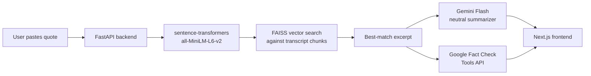

# Verbatim.ai

**From soundbite to full story, instantly.**

Verbatim.ai detects a political quote, traces it back to its verified source transcript using semantic search, generates a neutral AI context summary, and surfaces related fact-checks — all in under 30 seconds.

🔗 **Live demo:** [verbatim-ai.vercel.app](https://verbatim-ai.vercel.app) *(coming soon)*

---

## What it does

Political quotes travel fast — usually stripped of the sentence before and after. Verbatim.ai gives you the full picture:

1. **You paste a quote** (and optionally the speaker's name)
2. **Semantic search** matches it against a database of verified Congressional Record and press briefing transcripts
3. **Gemini Flash** generates a 2-3 sentence neutral context summary from the matched excerpt
4. **Fact-checks** from PolitiFact, FactCheck.org, and others surface automatically via the Google Fact Check Tools API

---

## Architecture



---

## Tech stack

| Layer | Technology |
|---|---|
| Frontend | Next.js 14 (App Router) + Tailwind CSS |
| Backend | FastAPI (Python 3.11) |
| Embeddings | `sentence-transformers` all-MiniLM-L6-v2 |
| Vector search | FAISS IndexFlatIP |
| Database | SQLite via SQLAlchemy |
| LLM | Google Gemini Flash (free tier) |
| Fact-check | Google Fact Check Tools API (ClaimReview) |
| Deployment | Vercel (frontend) + Render (backend) |

---

## Running locally

### 1. Backend

```bash
cd verbatim-ai
python3 -m venv .venv && source .venv/bin/activate
pip install -r backend/requirements.txt

cp .env.example .env
# Fill in GOOGLE_AI_API_KEY and CONGRESS_API_KEY in .env
```

Get a free Google AI Studio key at [aistudio.google.com/apikey](https://aistudio.google.com/apikey) — no credit card required.

Get a free Congress.gov API key at [api.congress.gov](https://api.congress.gov/sign-up/).

**Ingest transcripts and build the search index:**

```bash
python -m backend.scripts.ingest_congress --limit 50
python -m backend.scripts.build_index
```

**Start the API server:**

```bash
uvicorn backend.main:app --reload
# API at http://localhost:8000
# Docs at http://localhost:8000/docs
```

### 2. Frontend

```bash
cd frontend
cp .env.local.example .env.local
npm install
npm run dev
# App at http://localhost:3000
```

---

## API reference

| Method | Endpoint | Description |
|---|---|---|
| POST | `/api/quotes` | Submit a quote for processing |
| GET | `/api/quotes/{id}` | Poll for result |
| GET | `/health` | Liveness check |

**Submit a quote:**

```bash
curl -X POST http://localhost:8000/api/quotes \
  -H "Content-Type: application/json" \
  -d '{"text": "We will protect Social Security and Medicare.", "speaker": "Joe Biden"}'
```

**Poll result:**

```bash
curl http://localhost:8000/api/quotes/1
```

```json
{
  "quote_id": 1,
  "status": "complete",
  "match": {
    "transcript_title": "Senate Finance Committee Hearing, 2025-09-12",
    "source_url": "https://congress.gov/...",
    "excerpt": "...the Senator was responding to a question about...",
    "similarity": 0.87
  },
  "summary": "The speaker was outlining their position on entitlement programs...",
  "fact_checks": [
    { "publisher": "PolitiFact", "rating": "Mostly True", "url": "https://..." }
  ]
}
```

---

## Status

- [x] Core pipeline: quote → semantic match → AI context
- [x] Fact-check integration via ClaimReview
- [x] Web interface
- [ ] Social media monitoring (trending quote auto-detection)
- [ ] Speaker verification dashboard
- [ ] Mobile app

---

## License

MIT
